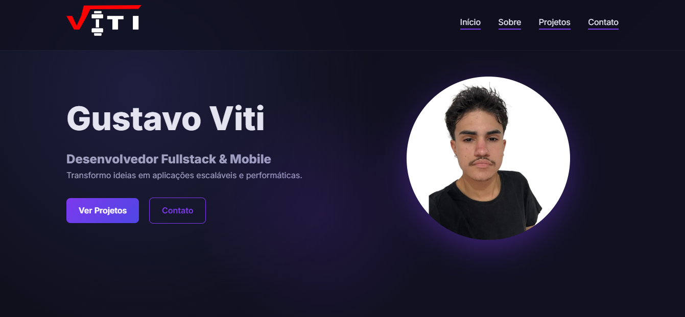

# 🚀 Gustavo Viti — Portfólio Profissional

### 👨‍💻 Desenvolvedor Fullstack & Mobile  
Construindo aplicações modernas, performáticas e bem estruturadas.

🌐 **Acesse online:**  
👉 https://gustavoviti.vercel.app/

---

## 📸 Preview do Projeto

  

> ⚠️ Dica: Tire um print bonito da home e salve como `preview.png` dentro de `assets/image`.

---

## 🧠 Sobre o Projeto

Este portfólio foi desenvolvido com foco em:

- 🎨 UI moderna (Dark Theme Premium)
- ✨ Micro-interações suaves
- 🚀 Animações de entrada com efeito *stagger*
- 💡 Efeito de luz dinâmica seguindo o mouse
- 📱 Layout totalmente responsivo
- 🧩 Código organizado e comentado

Sem frameworks.  
Apenas **HTML, CSS e JavaScript puro**.

Este projeto representa minha evolução como desenvolvedor e minha busca por excelência técnica mesmo em projetos pessoais.

---

## 🛠️ Tecnologias Utilizadas

HTML5 • CSS3 • JavaScript • IntersectionObserver • Flexbox • CSS Grid • Vercel

---

## ✨ Funcionalidades Implementadas

✔ Navbar fixa com scroll spy ativo  
✔ Underline dinâmico na seção atual  
✔ Animações de entrada suaves  
✔ Cards interativos com hover elegante  
✔ Efeito de luz premium no Hero  
✔ Grid responsivo para projetos  
✔ Download de currículo  
✔ Links diretos para redes profissionais  

---

## 📂 Estrutura do Projeto

📦 portfolio
┣ 📂 assets
┃ ┣ 📂 image
┃ ┃ ┣ perfil.png
┃ ┃ ┗ preview.png
┃ ┗ currículo.docx.pdf
┣ 📂 style
┃ ┗ style.css
┣ index.html
┗ README.md

---

## 🎯 Objetivo

Este projeto faz parte da minha jornada para conquistar minha primeira oportunidade como Desenvolvedor Júnior.

Busco:

Evolução técnica constante

Código limpo e organizado

Boas práticas desde o início

Crescimento sólido (sem atropelar etapas)

---

## 📬 Contato

📧 Email: gustavoviti543@gmail.com

💼 LinkedIn: https://linkedin.com/in/gustavoviti

💻 GitHub: https://github.com/GustavoViti

📸 Instagram Dev: https://instagram.com/gustavo_viti_dev

---

## 📊 Status do Projeto

🟢 Concluído (v1.0)
🔄 Em evolução contínua

---

## 💬 Considerações Finais

Este portfólio não é apenas uma vitrine.

Ele representa:

Minha disciplina

Minha evolução

Minha atenção aos detalhes

Minha mentalidade de produto

---

## Obrigado por visitar 🚀